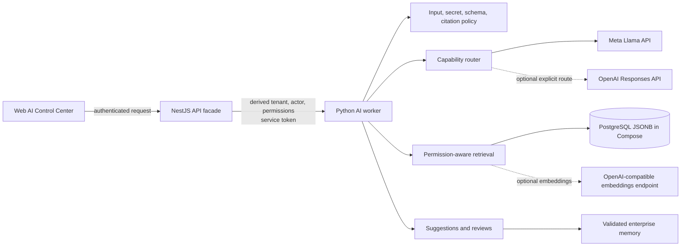

# AI Intelligence Architecture

Status: H1 implementation contract  
Last reviewed: 2026-07-15

## Purpose and authority boundary

The AI layer turns evidence an actor may access into reviewable knowledge candidates, entity-resolution assessments, event interpretations, causal-path explanations, simulation plans, prediction explanations, and technical facts. It does not authenticate users, derive tenant identity, calculate simulations or predictions, establish authoritative graph truth, approve itself, or execute external actions.

The implemented separation is:

- PostgreSQL stores tenant-scoped source chunks, provenance, suggestions, reviews, validated memory, learning outcomes, idempotency records, activity, and redacted audit records.
- Deterministic services calculate simulations and enforce domain mutations.
- Model-backed agents retrieve, structure, explain, and propose.
- Review can persist evidence-bound validated enterprise memory. It never writes the graph, changes a simulation, or invokes an external system.
- A validated learning outcome may be recorded only for an effectively approved suggestion and only with evidence from that suggestion.

## Runtime topology



Provider credentials live only in the worker. The public API derives tenant and actor context from the authenticated principal, translates platform capabilities to internal permissions, and calls the worker with `X-Internal-Tenant-Id`, `X-Internal-Actor-Id`, `X-Internal-Permissions`, and `X-Internal-Service-Token`. Those internal headers are not public tenant selectors.

## Model-backed run lifecycle

1. The public API validates its closed request shape and capability requirement, derives internal context, derives a worker idempotency key, and calls `POST /v1/ai/agent-runs`.
2. The worker validates idempotency, requires `ai.run`, applies the actor-scoped requests-per-minute limit, rejects detected prompt-injection patterns and configured secrets, and chooses the fixed agent specification.
3. The router selects `AI_PROVIDER_DEFAULT` for standard agents or `AI_REASONING_PROVIDER` for high-reasoning agents. There is no automatic provider hopping.
4. Retrieval limits content to the tenant, then applies source ACLs and requested permissions. Prompt evidence is serialized as untrusted data with UUID evidence identifiers, source locators, digests, and authorization bindings.
5. The context estimator includes the system prompt, JSON Schema, user envelope, session history, and evidence. Optional evidence/history is removed only at item boundaries; required evidence that cannot fit causes a closed failure.
6. On a cache miss, exactly one generation operation is issued to the selected provider adapter. The adapter may retry the same transport request according to its bounded retry policy. There is no agent tool loop, repair pass, consolidation pass, self-reflection pass, whole-workflow deadline, or cancellation signal.
7. After the provider call, the worker re-authorizes evidence and content digests, scans output for configured secrets, validates the agent-specific Pydantic schema, and verifies all cited evidence IDs and locators.
8. A valid result is persisted as a `PENDING_REVIEW` suggestion with provenance, redacted audit metadata, and activity. Model output never mutates graph, simulation, prediction, or external state.
9. `APPROVE` or `REJECT` is an idempotent, immutable effective review. Approval additionally persists validated enterprise memory; rejection does not.

## Status and health

`GET /v1/ai/status` returns only `ready` or `degraded`:

- `ready` means the durable store health check passes and every selected default/reasoning provider has a configured adapter.
- `degraded` means either condition is false.
- `providers[].configured` means a key/model pair produced an adapter. It is not proof that credentials, model access, or the remote endpoint work.
- `providers[].live_provider_verified` is currently always `false`. A credentialed external acceptance run is required before claiming live verification.
- `GET /health/ready` checks the worker store only; it does not call a model or embeddings provider.

The digital-twin API and deterministic simulation paths can operate while AI status is `degraded`. A model-backed run whose selected provider is absent fails closed; no canned, keyword, fake-vector, or simulated-model response is substituted.

## Canonical run result

The worker returns the following nested, provider-neutral shape. All identifiers shown as placeholders are UUIDs.

```json
{
  "run_id": "00000000-0000-4000-8000-000000000001",
  "suggestion": {
    "suggestion_id": "00000000-0000-4000-8000-000000000002",
    "run_id": "00000000-0000-4000-8000-000000000001",
    "tenant_id": "10000000-0000-4000-8000-000000000001",
    "actor_id": "20000000-0000-4000-8000-000000000001",
    "agent_type": "causal_analysis",
    "status": "PENDING_REVIEW",
    "confidence": 0.91,
    "evidence": [
      {
        "evidence_id": "30000000-0000-4000-8000-000000000001",
        "source_locator": "architecture.md#chunk=3"
      }
    ],
    "output": {
      "status": "PENDING_REVIEW",
      "confidence": 0.91,
      "evidence": [
        {
          "evidence_id": "30000000-0000-4000-8000-000000000001",
          "source_locator": "architecture.md#chunk=3"
        }
      ],
      "limitations": [],
      "chain": [],
      "affected_nodes": [],
      "probabilities_calculated": false
    },
    "provider": "llama",
    "model": "configured-exact-model-id",
    "usage": {
      "input_tokens": 0,
      "output_tokens": 0,
      "total_tokens": 0,
      "measurement": "unavailable"
    },
    "cost_usd": null,
    "cost_status": "unpriced",
    "cached": false,
    "cache_source_sha256": null,
    "mutation_performed": false,
    "created_at": "2026-07-15T12:00:00Z",
    "effective_review": null
  },
  "provider_audit": {
    "provider_request_id": null,
    "request_sha256": "aaaaaaaaaaaaaaaaaaaaaaaaaaaaaaaaaaaaaaaaaaaaaaaaaaaaaaaaaaaaaaaa",
    "response_sha256": "bbbbbbbbbbbbbbbbbbbbbbbbbbbbbbbbbbbbbbbbbbbbbbbbbbbbbbbbbbbbbbbb",
    "latency_ms": 0
  }
}
```

`usage.measurement` disambiguates the numeric counters:

- `provider_reported` means the generation provider supplied the counters. Both live generation adapters currently reject a response with missing or invalid usage.
- `unavailable` means the zero-valued compatibility counters are unknown, not measured zero usage.
- `cache_hit` means zero incremental provider tokens and cost; the provider request ID is `null`, latency is `0`, and `cache_source_sha256` identifies the validated source response.

## Review, memory, and learning

Suggestions remain `PENDING_REVIEW`; the immutable effective review is exposed separately as `effective_review`. Reviewing requires `ai.review` at the worker and an idempotency key. The public facade currently requires `connector.admin`. Repeating the same actor/decision is replay-safe; a competing or opposite effective decision conflicts.

Approval re-authorizes the cited evidence and persists a validated enterprise-memory record containing the suggestion output and provenance. Its default ACL is private to the reviewing actor and requires `ai.run`; future prompt use recursively re-authorizes every source binding. Approval does not promote a graph entity, execute a simulation, or trigger an external action.

`POST /v1/ai/learning/outcomes` records a `CONFIRMED` or `CORRECTED` outcome for an effectively approved suggestion. It requires a non-empty outcome object, a timezone-aware `observed_at`, an idempotency key, and a non-empty subset of that suggestion's authorized evidence IDs. The receipt explicitly reports `graph_mutation_performed: false` and `simulation_mutation_performed: false`.

Session memory is optional, actor/tenant/session scoped, sanitized, limited to the 20 newest returned entries, and expired according to `AI_SESSION_TTL_MINUTES`. It is unverified context. There is currently no public session-reset endpoint.

## Persistence and availability

Compose uses PostgreSQL through a dedicated `edt_ai_worker` role that is neither superuser nor `BYPASSRLS`. The table uses tenant-qualified keys, application tenant predicates, enabled and forced RLS, and a transaction-local `app.tenant_id` policy. The worker refuses a PostgreSQL role that can bypass RLS. File-backed SQLite is the isolated local/test default, not the enterprise system of record.

The provider timeout is per attempt. Bounded retries can make elapsed run time exceed one timeout, and the gateway currently has no end-to-end cancellation propagation. The API facade has its own HTTP wait timeout, but that does not constitute a worker-wide deadline or provider cancellation contract.

## Implemented controls and current limits

- Per-actor, in-process request-rate limiting; no distributed concurrency quota or tenant daily budget.
- Optional per-request `max_cost_usd`, usable only when both selected-provider price rates are configured; conservative preflight and provider-usage postflight checks.
- Exact 5 MiB decoded document ceiling, bounded chunks/candidates/results, input estimate, output-token cap, cache size/TTL, retry count, and session TTL.
- Redacted audit hashes, provider/model, evidence IDs, usage, cost status, and review status. Prompts, raw documents, credentials, and raw upstream errors are not audit payloads.
- Activity kinds are `agent_run`, `document_import`, `retrieval`, `suggestion_review`, and `learning_outcome`; an agent run moves through `running` to `succeeded` or `failed`. There is no queue-control or cancellation endpoint.
- Live provider behavior remains unverified in a credential-free checkout. Production promotion requires credentialed schema, grounding, isolation, injection, refusal, latency, token, cost, and regression evaluations for an exact model configuration.

Detailed contracts live in [AI_AGENTS.md](AI_AGENTS.md), [AI_PROVIDER_SYSTEM.md](AI_PROVIDER_SYSTEM.md), [AI_SECURITY.md](AI_SECURITY.md), and [RAG_ARCHITECTURE.md](RAG_ARCHITECTURE.md).
